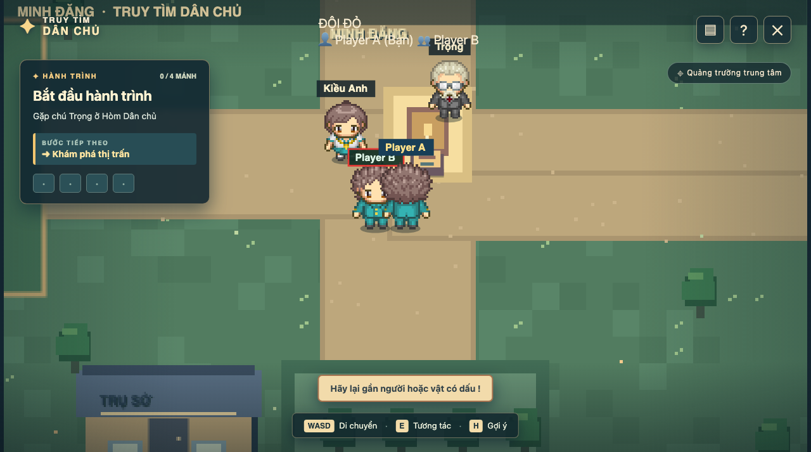

# BÁO CÁO NGHIỆM THU PHASE 15 — GẶP NPC TÍNH CHUNG CHO ĐỘI

> **Dự án:** Trò chơi giáo dục "Truy tìm Dân chủ" (Multiplayer)  
> **Thời điểm nghiệm thu:** 15/09/2026  
> **Trạng thái:** HOÀN THÀNH VÀ ĐẠT 100% TIÊU CHÍ NGHIỆM THU  

---

## 1. Mục tiêu và phạm vi hoàn thành của Phase 15

Theo đặc tả tại `PHASE_CODE_MULTIPLAYER.md` và `DAC_TA_MULTIPLAYER.md`:
1. **Tương tác NPC Authoritative trên Máy chủ:**
   - Client gửi `InteractRequest(RoomId, PlayerId, ObjectId, CommandId)`.
   - Máy chủ kiểm tra vị trí người chơi và đối tượng: cự ly phải `<= 31px` (`MaxInteractionDistance`). Nếu người chơi ở xa (> 31px), máy chủ từ chối với mã lỗi `OUT_OF_RANGE`.
   - Kiểm tra `CommandId` để đảm bảo tính bất biến (idempotency), ngăn ngừa việc một thao tác bị tính lặp nhiều lần khi mạng lag hoặc gửi lại.
2. **Tiến độ đội dùng chung nhưng đối thoại độc lập:**
   - Khi người chơi tương tác với NPC (ví dụ Phương, Dũng, Bảo, Nam hoặc Trọng):
     - Người chơi đó mở hội thoại cá nhân (`Dialogue panel`) trên giao diện của mình để đọc cốt truyện.
     - Cờ tiến độ nhiệm vụ của đội (`Progress.Spoken[i] = true` hoặc chuyển `Chapter.Lights`) được cập nhật nguyên tử trên máy chủ, tăng `Progress.Version`.
     - Máy chủ phát `TeamStateUpdated` tới nhóm SignalR của đội (`team_{teamId}`).
     - Các đồng đội khác nhận được cờ tiến độ mới, thẻ nhiệm vụ cập nhật, nhưng **giao diện của đồng đội không bị khóa bởi đối thoại**, đồng đội vẫn tự do di chuyển và tương tác độc lập.
3. **Chống kéo lùi tiến độ (Outdated Snapshot Rejection):**
   - Client bỏ qua các snapshot có `Version < CurrentVersion` để chống bị trễ mạng kéo lùi tiến độ đã đạt được.
4. **Bảo toàn cách ly mạng và Single-Player:**
   - Đội này gặp NPC hoàn toàn không ảnh hưởng tới tiến độ và cờ của đội khác.
   - Chế độ Single-player (`GameSmoke`) hoạt động 100% nguyên vẹn.

---

## 2. Danh sách mã nguồn và thay đổi

| Thành phần | Tập tin | Mô tả chi tiết |
|---|---|---|
| **Dữ liệu vị trí NPC dùng chung** | `Shared/Game/TownCollision.cs` | Bổ sung danh mục `Places`, `MaxInteractionDistance = 31f`, `Neighbors` và `NeighborIds` |
| **Giao thức tương tác** | `Shared/InteractModels.cs` | Khai báo `InteractRequest`, `InteractResponse`, và các mã lỗi `InteractErrorCodes` (`OUT_OF_RANGE`, `OBJECT_NOT_FOUND`, `PLAYER_NOT_IN_TEAM`...) |
| **Authoritative Logic máy chủ** | `Server/TeamGameInstance.cs` | Hiện thực `TryProcessInteract` kiểm tra cự ly `<= 31px`, chuyển `Opening -> Lights`, cập nhật nguyên tử `Spoken` flags và xử lý idempotency qua `_processedCommands` |
| **SignalR Hub tương tác** | `Server/RoomHub.cs` | Bổ sung Hub method `Interact`, phát sự kiện `TeamStateUpdated` tới nhóm `team_{teamId}` khi có mutation |
| **Kết nối Client** | `Services/MultiplayerConnection.cs` | Bổ sung method `InteractAsync(InteractRequest)` |
| **Phiên chơi Multiplayer** | `Shared/Game/MultiplayerSession.cs` | Hiện thực `Interact()` gửi yêu cầu lên server authoritative, mở hội thoại cá nhân, và kiểm tra `Version` bỏ snapshot cũ trong `ApplySnapshot` |
| **UI Game View** | `Pages/MultiplayerGameView.razor` | Truyền `OnInteract` từ `MultiplayerConnection` vào `MultiplayerSession` |
| **Kiểm thử đơn vị** | `Tests/Multiplayer.UnitTests/NpcProgressTests.cs` | Bộ 9 unit tests: kiểm tra cự ly > 31px, object lạ, chuyển Opening->Lights, idempotency CommandId, Spoken flag nguyên tử, 2 người gặp cùng NPC, 2 người gặp 2 NPC khác nhau, bỏ snapshot cũ, cách ly đội |
| **Kiểm thử tích hợp** | `Tests/Multiplayer.IntegrationTests/NpcProgressIntegrationTests.cs` | Kiểm tra luồng SignalR Hub tương tác NPC thực tế và cách ly đội |
| **Kiểm thử Chrome CDP** | `scratch/verify_phase15.mjs` | Kịch bản 4 phiên Chrome headless CDP kiểm tra tương tác NPC dùng chung, đối thoại cá nhân độc lập và cách ly đội |

---

## 3. Kết quả kiểm thử tự động

### 3.1. Unit Tests (`Multiplayer.UnitTests`)
```text
Passed!  - Failed: 0, Passed: 144, Skipped: 0, Total: 144, Duration: 21 ms - Multiplayer.UnitTests.dll (net10.0)
```
- 144/144 tests thành công 100% (bao gồm 9 test mới của `NpcProgressTests`).

### 3.2. Integration Tests (`Multiplayer.IntegrationTests`)
```text
Passed!  - Failed: 0, Passed: 19, Skipped: 0, Total: 19, Duration: 2 s - Multiplayer.IntegrationTests.dll (net10.0)
```
- 19/19 tests thành công 100% (bao gồm test tích hợp mới `NpcProgressIntegrationTests`).

### 3.3. Single-Player Regression (`GameSmoke`)
```text
PASS: mở đầu, 4 nhiệm vụ, lựa chọn sai, phản hồi cuối và lưu/tiếp tục.
```

---

## 4. Kết quả nghiệm thu giao diện Chrome CDP

1. **Player A (Đội Đỏ):** Di chuyển tiếp cận chú Trọng và bấm `E` tương tác.
   - Minh chứng: `p15_01_player_a_dialogue_opening.png`
   

2. **Player B (Đội Đỏ):** Nhận được cập nhật trạng thái của đội sang chương Bốn ngọn đèn, nhưng giao diện hoàn toàn không bị popup đối thoại che khuất.
   - Minh chứng: `p15_02_player_b_free_with_team_lights_chapter.png`
   

3. **Player A:** Hoàn thành mở đầu và tiếp tục hành trình.
   - Minh chứng: `p15_03_player_a_chapter_lights.png`
   

4. **Player C (Đội Xanh):** Đứng ở bản đồ riêng, độc lập 100%, không bị ảnh hưởng bởi tiến độ của Đội Đỏ.
   - Minh chứng: `p15_04_player_c_isolated_opening.png`
   

---

## 5. Kết luận nghiệm thu

Phase 15 đã hoàn thành xuất sắc toàn bộ tiêu chí kỹ thuật: tương tác NPC được máy chủ xác thực cự ly, cập nhật tiến độ đội dùng chung, đối thoại cá nhân độc lập không khóa UI đồng đội, và bảo toàn cách ly tuyệt đối giữa các đội. Đủ điều kiện chuyển sang **Phase 16: Thu thập vật phẩm cho cả đội (Bản demo hoàn chỉnh)**.

