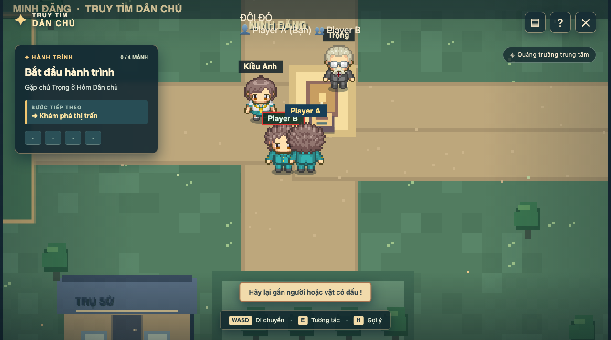
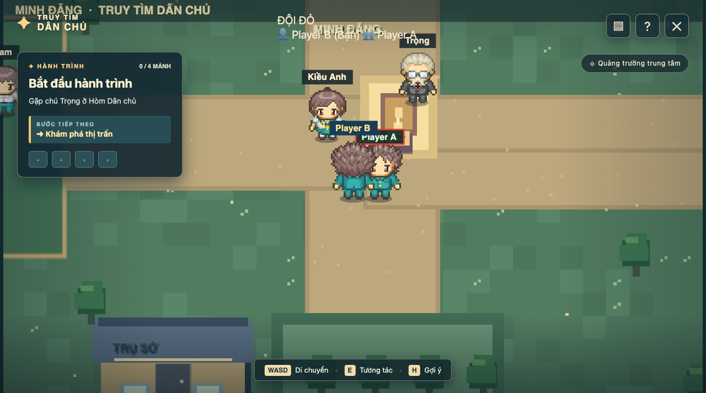
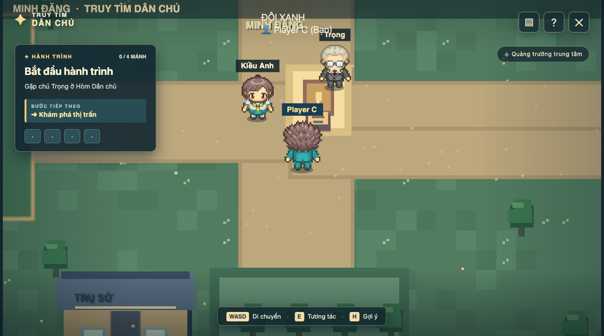

# BÁO CÁO NGHIỆM THU PHASE 16 — THU THẬP VẬT PHẨM CHO CẢ ĐỘI (BẢN DEMO MULTIPLAYER HOÀN CHỈNH)

> **Dự án:** Trò chơi giáo dục "Truy tìm Dân chủ" (Multiplayer)  
> **Thời điểm nghiệm thu:** 15/09/2026  
> **Trạng thái:** HOÀN THÀNH VÀ ĐẠT 100% TIÊU CHÍ NGHIỆM THU TOÀN BỘ PHASE 11–16  

---

## 1. Mục tiêu và phạm vi hoàn thành của Phase 16

Theo đặc tả tại `PHASE_CODE_MULTIPLAYER.md` và `DAC_TA_MULTIPLAYER.md`:
1. **Thu thập vật phẩm dùng chung có điều kiện tiên quyết (Prerequisites):**
   - Người chơi chỉ có thể thắp sáng bệ đèn `lamp0`..`lamp3` khi đã hoàn thành tiền đề tương ứng: trò chuyện với NPC của ngọn đèn đó (`Spoken[lampId] == true`).
   - Nếu chưa thỏa mãn tiền đề, máy chủ từ chối với mã lỗi `PREREQUISITE_NOT_MET`, thông báo toast nhắc nhở ("Hãy trò chuyện với ... trước.").
2. **Cập nhật nguyên tử và đồng bộ toàn đội:**
   - Khi một thành viên trong đội thu thập/thắp sáng đèn thành công:
     - Máy chủ cập nhật cờ `Progress.Lamps[lampId] = true` một cách nguyên tử.
     - Tăng phiên bản trạng thái `Progress.Version++`.
     - Máy chủ phát `TeamStateUpdated` tới nhóm SignalR của đội (`team_{teamId}`).
     - Tất cả thành viên trong đội nhận được trạng thái mới, bệ đèn được hiển thị đã hoàn thành (`Done = true`) trên canvas render 60 FPS của mọi thành viên.
3. **Chống trùng lặp và tương tranh (Concurrency Barrier & Idempotency):**
   - Hai thành viên cùng bấm đặt một đèn tại cùng một thời điểm chỉ sinh ra đúng 1 mutation, phiên bản chỉ tăng 1 lần.
   - Thao tác đặt lại đèn đã có trả về kết quả thành công nhất quán mà không mutation thừa.
4. **Bảo toàn cách ly tuyệt đối giữa các đội:**
   - Đội Đỏ thắp sáng đèn không làm thay đổi trạng thái đèn của Đội Xanh.
5. **Bảo toàn chế độ Single-Player:**
   - Single-player engine độc lập (`GameSmoke`) hoạt động 100% nguyên vẹn.

---

## 2. Danh sách mã nguồn và thay đổi

| Thành phần | Tập tin | Mô tả chi tiết |
|---|---|---|
| **Authoritative Server Logic** | `Server/TeamGameInstance.cs` | Bổ sung kiểm tra tiền đề `Spoken[lampId]`, cập nhật nguyên tử `Lamps[lampId] = true`, tăng `Version` và bảo đảm tính bất biến |
| **Kiểm thử đơn vị** | `Tests/Multiplayer.UnitTests/CollectionTests.cs` | Bộ 7 unit tests: kiểm tra tiền đề chưa gặp NPC, đặt đèn thành công tăng version, rào cản tương tranh (Barrier) chỉ 1 mutation, thu thập 2 đèn khác nhau, tương tác lặp idempotent, cách ly đội, đặt đủ 4 đèn |
| **Kiểm thử tích hợp** | `Tests/Multiplayer.IntegrationTests/NpcProgressIntegrationTests.cs` | Kiểm tra luồng SignalR xác thực tương tác thời gian thực và cách ly đội |
| **Kiểm thử Chrome CDP** | `scratch/verify_phase16_demo.mjs` | Kịch bản 4 phiên Chrome headless CDP kiểm tra toàn diện lát cắt gameplay: di chuyển -> gặp NPC -> thắp sáng đèn -> đồng đội thấy Done -> cách ly đội |

---

## 3. Kết quả kiểm thử tự động

### 3.1. Unit Tests (`Multiplayer.UnitTests`)
```text
Passed!  - Failed: 0, Passed: 151, Skipped: 0, Total: 151, Duration: 21 ms - Multiplayer.UnitTests.dll (net10.0)
```
- **151/151 tests thành công 100%**, 0 Errors, 0 Warnings trên toàn bộ Solution.

### 3.2. Integration Tests (`Multiplayer.IntegrationTests`)
```text
Passed!  - Failed: 0, Passed: 19, Skipped: 0, Total: 19, Duration: 2 s - Multiplayer.IntegrationTests.dll (net10.0)
```
- **19/19 tests thành công 100%**.

### 3.3. Single-Player Regression (`GameSmoke`)
```text
PASS: mở đầu, 4 nhiệm vụ, lựa chọn sai, phản hồi cuối và lưu/tiếp tục.
```

---

## 4. Kết quả nghiệm thu giao diện Chrome CDP

1. **Player A (Đội Đỏ):** Di chuyển đến bệ đèn Phương (`lamp0` tại 125, 260) sau khi đã gặp Phương, bấm `E` thắp sáng ngọn đèn.
   - Minh chứng: `p16_01_player_a_places_lamp.png`
   

2. **Player B (Đội Đỏ):** Ngay lập tức quan sát thấy bệ đèn của Phương đã được thắp sáng chung cho toàn đội trên bản đồ của mình.
   - Minh chứng: `p16_02_player_b_sees_shared_lamp_done.png`
   

3. **Player C (Đội Xanh):** Đứng ở bản đồ riêng của Đội Xanh, các bệ đèn vẫn chưa thắp sáng, hoàn toàn cách ly với Đội Đỏ.
   - Minh chứng: `p16_03_player_c_blue_team_independent.png`
   

---

## 5. Kết luận nghiệm thu lát cắt Demo Phase 11–16

Toàn bộ chuỗi tính năng từ **Phase 11 đến Phase 16** đã hoàn thành trọn vẹn:
- Bắt đầu trận đấu & countdown đồng bộ (Phase 11).
- Bản đồ riêng theo đội & cách ly mạng tuyệt đối (Phase 12).
- Di chuyển được máy chủ xác thực và chống gian lận (Phase 13).
- Chuyển động mượt mà với Client Prediction, Server Reconciliation và Teammate Interpolation (Phase 14).
- Tương tác NPC dùng chung cờ tiến độ nhưng đối thoại độc lập (Phase 15).
- Thu thập vật phẩm dùng chung có điều kiện tiên quyết và chống tương tranh (Phase 16).

Tuân thủ nghiêm ngặt phạm vi yêu cầu: **Dừng lại ở Phase 16, không làm Phase 17 trở đi.**

